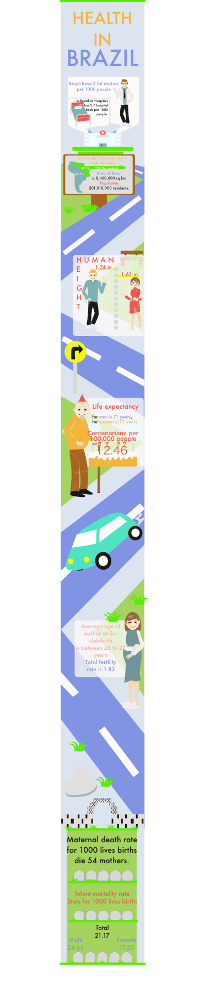

Design Blog
======

Design Journal for Introduction to Design

Internship in Clinishare

On my internship I met great people and spent great time in a nice atmosphere. I learned a few new, useful things. Now I know how use Adobe Illustrator and Sketch 3 and keyboard shortcut for this programs. First I learned how do icon for mobile application in different styles and also I create my style. Later I try made infographic, that was something new for me and at start that was hard to do but with time I become better. Also a create some character who doesn’t look like stick-man, I think this is the best thing which I could learn here because to learn it I had to made up my style. I improve my design skills and that will be helpful in future. About my English I can tell this, it’s not better but I feel free to use it and don’t scare of mistakes. If I have a problem or don’t remember how to tell something, I try use another words.

My works
======

